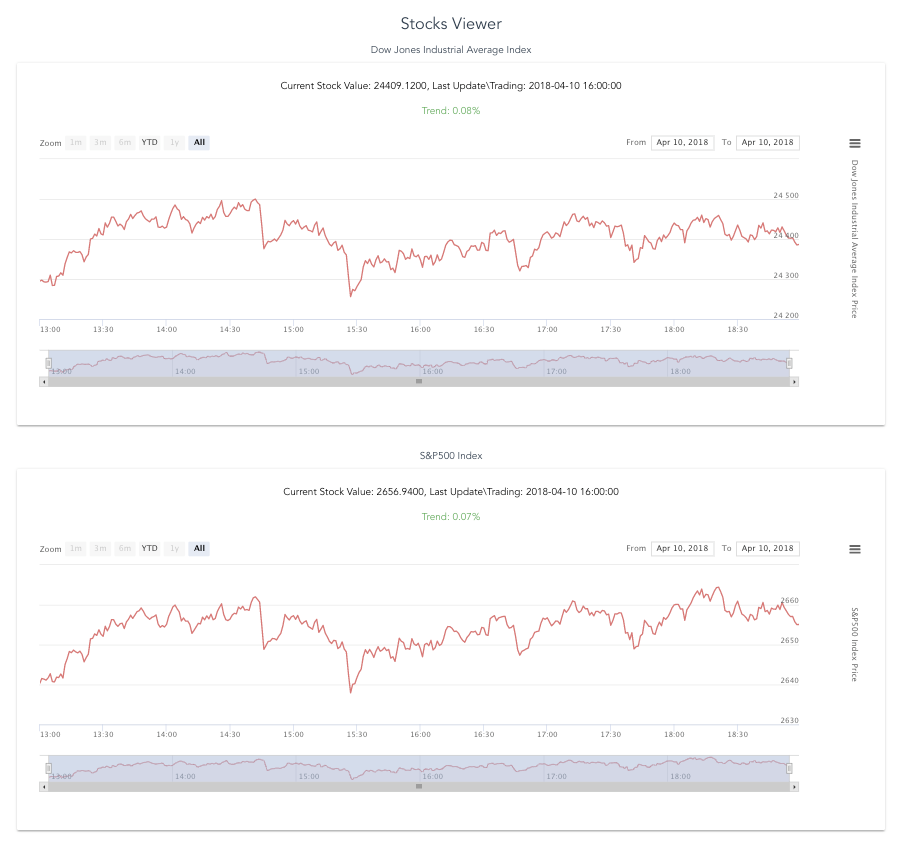

# stock-viewer

> A Vue.js project - simple stocks viewer
<p align="center">
  
</p>

## Build Setup

``` bash
# install dependencies
npm install

# serve with hot reload at localhost:8080
npm run dev

# build for production with minification
npm run build

# build for production and view the bundle analyzer report
npm run build --report
```

# Run master branch
* Data from alphavantage.co
* Charts from highcharts.com

Enjoy
